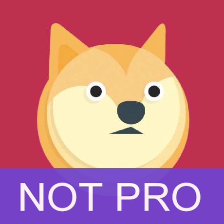

# NOT PRO

GitHub made paid user `PRO`.

So, I guess i'm `NOT PRO`

"NOT PRO" just puts a "NOT PRO" under your head.

### Before


### Run

```go
go get github.com/CovenantSQL/notpro
$GOPATH/bin/notpro -input head.jpeg
```

### After


